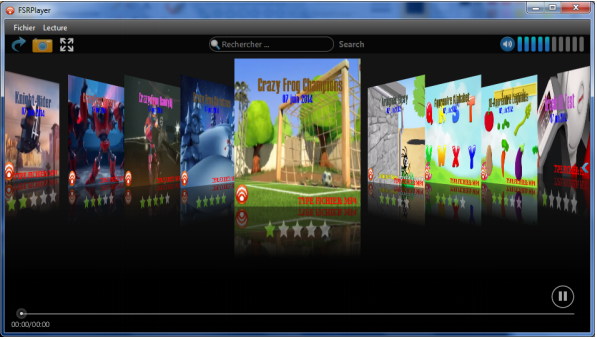

# Media-Player-project

My mediaPlyer application with an interactive and rich interface, can reads and manages multimedia files. 
allows: 
- View multimedia content and metadata playback. 
- Organize its data. 
- Audio and video player, web radio playback, web TV.

